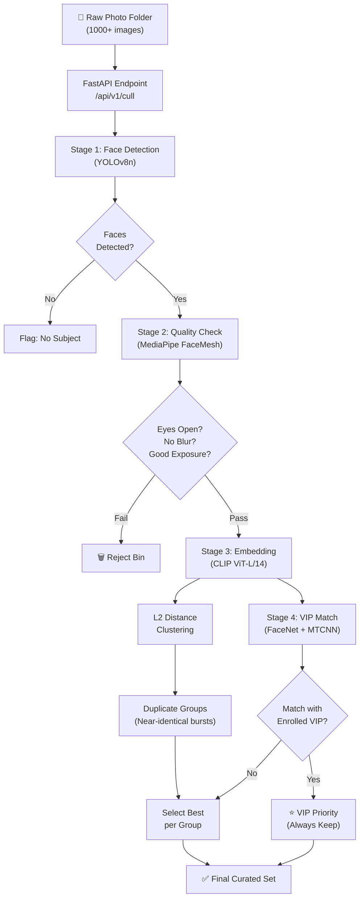

[<i class="fab fa-fw fa-github"></i> View Source Code](https://github.com/chhayanshporwal/AI-Wedding-Culling-Suite)

**Summary:** An automated REST pipeline that evaluates massive bursts of wedding photos to filter out bad shots and group duplicates.

*   **Problem:** Wedding photographers spend countless hours manually culling thousands of burst shots, wasting time identifying blurry images, closed eyes, and redundant frames.
*   **Solution:** Deployed an automated pipeline that evaluates images using facial landmark detection to reject poor photos (motion blur, closed eyes). It also utilizes embedding clustering to group near-duplicate burst shots and specialized models to preserve images of enrolled VIPs.
*   **Tech Stack:** Python, FastAPI, YOLOv8n, MediaPipe FaceMesh, CLIP ViT-L/14, OpenCV, MTCNN.
*   **Outcome:** Drastically reduced manual review time for photographers by reliably automating the rejection of low-quality images and intelligently organizing vast datasets.

### Pipeline Architecture

*   **What I learned:** Mastered chaining multiple heavy computer vision models in a FastAPI backend and handling complex vector mathematics (L2 distance) for accurate image clustering.