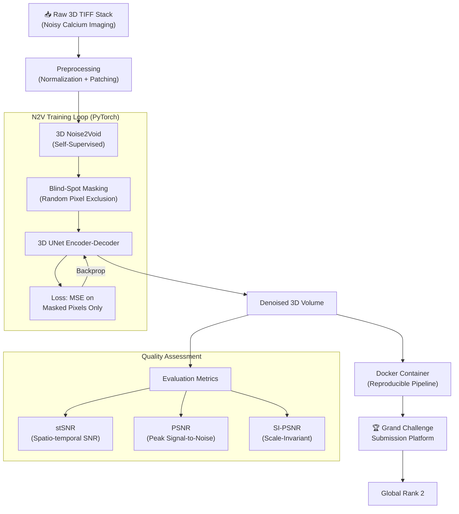

**Summary:** A competitive research pipeline achieving **Global Rank 2** in the AI4Life International Grand Challenge — denoising high-resolution biological calcium imaging without any clean ground truth data.

*   **Problem:** High-resolution biological calcium imaging suffers from severe noise, and acquiring clean "ground truth" data for supervised machine learning is practically impossible in this domain.
*   **Solution:** Built a self-supervised Noise2Void (N2V) model utilizing PyTorch for denoising high-resolution 3D calcium imaging data. The model extracts clean signals while strictly preserving the spatial and temporal integrity of the biological data. Evaluated efficacy using stSNR, PSNR, and SI-PSNR metrics.
*   **Tech Stack:** Python, PyTorch, 3D Noise2Void, Docker, NumPy, SciPy.
*   **Outcome:** Successfully containerized the final pipeline via Docker for deployment and evaluation on the Grand Challenge platform. Achieved **Global Rank 2** by ensuring robust generalization across unseen datasets.

### Denoising Pipeline Architecture

*   **What I learned:** Acquired advanced skills in handling massive 3D scientific datasets, tuning self-supervised machine learning models without ground truth labels, and strictly adhering to competitive research deployment standards using Docker.
