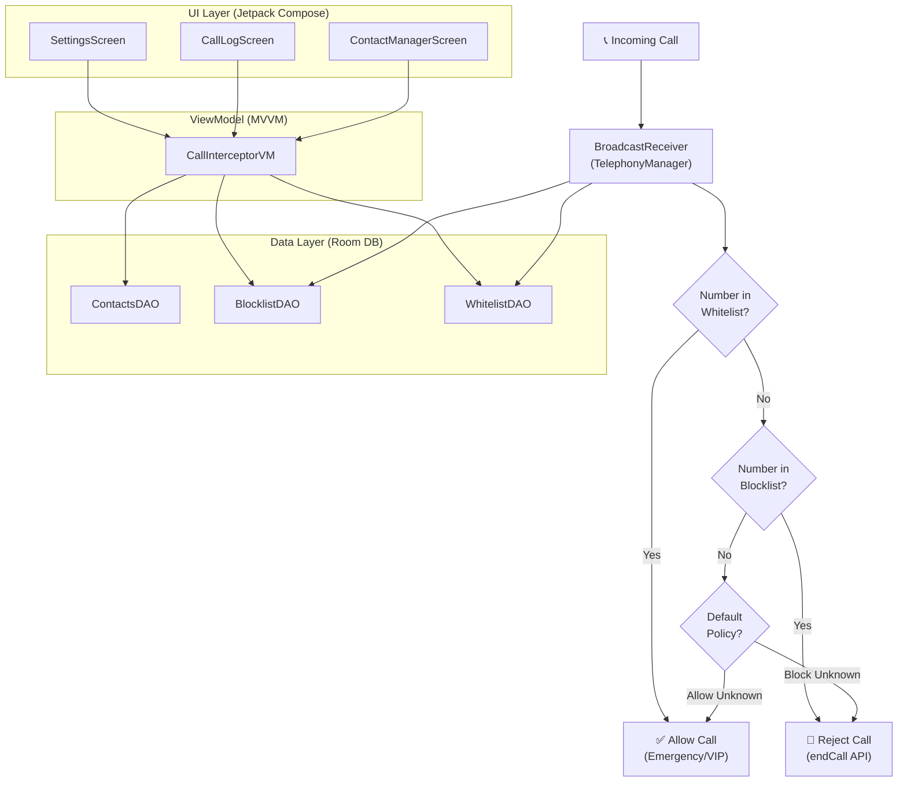

[<i class="fab fa-fw fa-github"></i> View Source Code](https://github.com/chhayanshporwal/CallSentry) | [<i class="fas fa-fw fa-download"></i> Download APK (Beta)](https://github.com/chhayanshporwal/CallSentry/releases/tag/v1.0.0-beta)

**Summary:** A system-level Android application that balances strict communication privacy with reliable emergency contact routing.

*   **Problem:** Existing call blockers either let spam through or rigidly block everything, lacking fine-grained control to ensure critical emergency calls can bypass filters safely.
*   **Solution:** Built a native Android application using Kotlin to provide offline, privacy-first call and SMS filtering. Architected a custom background service using Broadcast Receivers and system-level permissions to intercept and evaluate incoming calls. It checks numbers against a secure local whitelist-based blocking architecture to enforce privacy controls while guaranteeing emergency contacts are routed immediately.
*   **Tech Stack:** Kotlin, Jetpack Compose, MVVM Architecture, Room Database, Android Telephony System APIs, Broadcast Receivers.
*   **Outcome:** Executed rapid prototyping to deliver a stable, production-ready application within a highly constrained **3-day development lifecycle**. Achieved robust, low-latency call interception without draining battery life or blocking the main UI thread.

### System Architecture

*   **What I learned:** Deepened my understanding of Android system-level APIs, managed complex background service lifecycles securely, and implemented strict MVVM separation for asynchronous data flows.