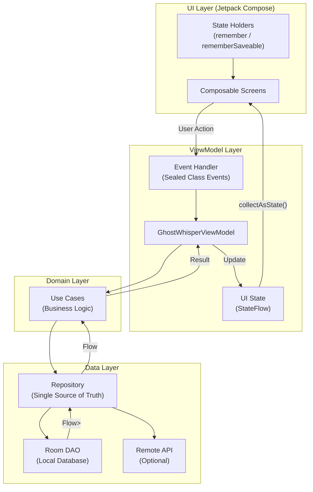

**Summary:** A focused implementation of modern Android UI patterns and reactive state management.

*   **Problem:** As codebases grow, UI state management often becomes tightly coupled with business logic, leading to UI lag and difficult-to-maintain code.
*   **Solution:** Implemented a strict MVVM architecture to decouple the UI from data processing, utilizing modern declarative UI frameworks to ensure a smooth, reactive user experience.
*   **Tech Stack:** Kotlin, Jetpack Compose, MVVM Architecture, Room Databases.
*   **Outcome:** Delivered a highly responsive, easily maintainable codebase that serves as a personal template for scalable native Android development.

### Architecture Pattern

*   **What I learned:** Refined my understanding of declarative UI paradigms with Jetpack Compose and ensuring unidirectional data flow in native Android environments.