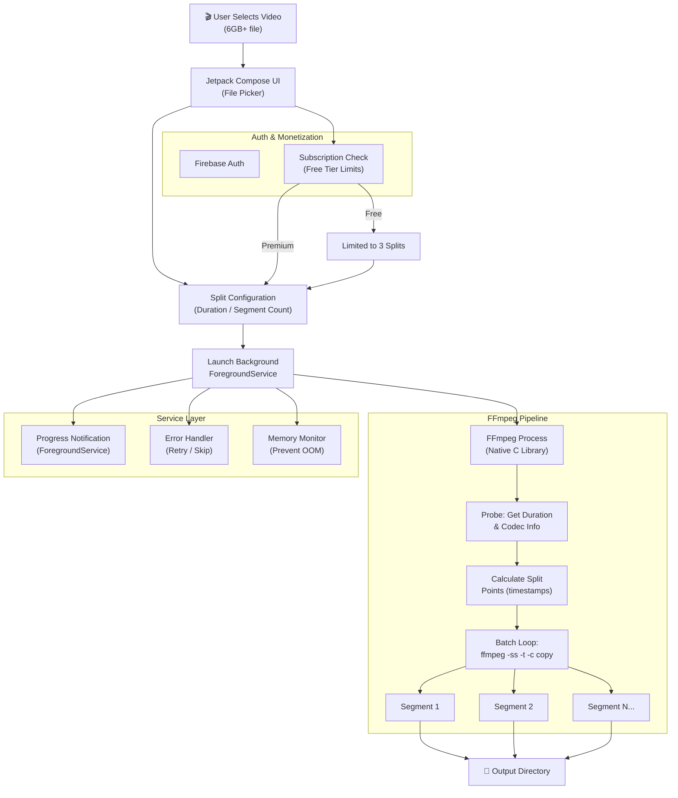

**Summary:** A robust native Android utility built to safely and quickly split massive video files directly on mobile hardware.

*   **Problem:** Standard mobile video editors crash, corrupt data, or freeze the UI when attempting to parse, split, or batch-process incredibly large (6GB+) video files.
*   **Solution:** Built a high-performance application utilizing FFmpeg for the heavy lifting, executed entirely within background services to prevent UI blocking. Integrated secure user authentication and a subscription-based model.
*   **Tech Stack:** Kotlin, Jetpack Compose, FFmpeg, Android Background Services, Firebase.
*   **Outcome:** Achieved highly stable batch processing of massive video files directly on mobile devices without memory leaks or UI thread freezing.

### Processing Architecture

*   **What I learned:** Gained crucial experience integrating native C-libraries (FFmpeg) into Android, handling long-running background tasks reliably, and implementing functional mobile monetization architectures.