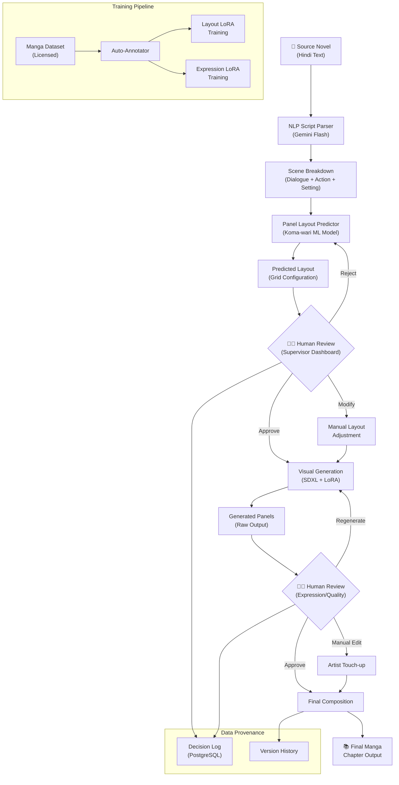

**Summary:** An ambitious pipeline bridging traditional storytelling and digital engineering by automating manga production from text descriptions.

*   **Problem:** Converting text to manga requires complex spatial understanding, narrative pacing, and layout design that standard, fully-automated generative AI completely fails to grasp.
*   **Solution:** Engineered a pipeline utilizing NLP for script parsing, machine learning for dynamic panel layout prediction (koma-wari), and auto-annotation to guide visual generation. Crucially, it relies on a "Human-In-The-Loop" architecture, allowing artists to intervene and refine the AI's outputs at any stage.
*   **Tech Stack:** Python, Machine Learning, NLP, Auto-Annotation Tools.
*   **Outcome:** Created a semi-automated system that exponentially speeds up the drafting process while retaining human creative control over the final visual narrative.

### HITL Pipeline Architecture

*   **What I learned:** Mastered the integration of "Human-In-The-Loop" software architectures, balancing automated AI generation with necessary manual adjustments, and translating artistic concepts into code.