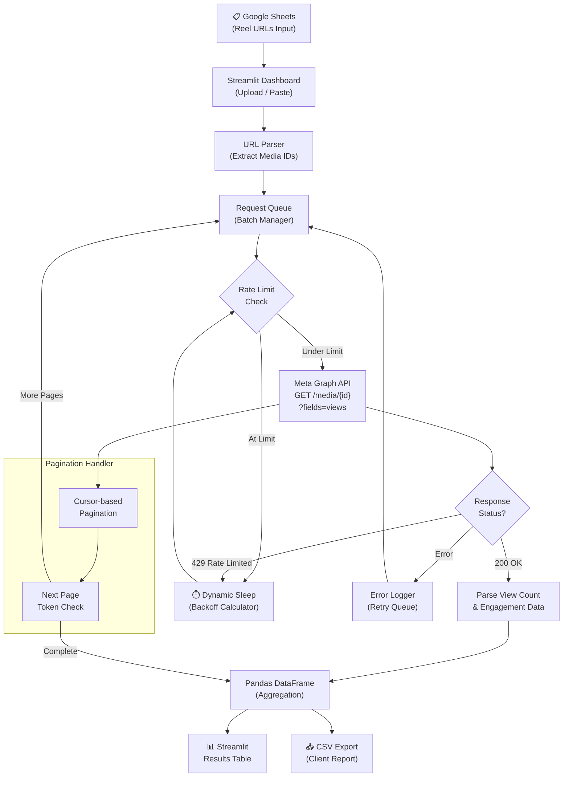

**Summary:** An automated analytics tool designed to bypass manual data entry for large-scale social media campaigns.

*   **Problem:** Marketing and analytics teams face strict API rate limits and manual labor bottlenecks when trying to scrape metrics for hundreds of Instagram reels across multiple accounts simultaneously.
*   **Solution:** Engineered a Python application that ingests links via Google Sheets and intelligently manages Meta Graph API requests. It dynamically calculates sleep delays and adjusts pagination to extract exact view counts without triggering rate-limit bans.
*   **Tech Stack:** Python, Streamlit, Meta Graph API, Pandas.
*   **Outcome:** Streamlined the analytics pipeline, enabling the flawless extraction of hundreds of metrics in a single run, directly exportable for client reporting.

### Data Extraction Flow

*   **What I learned:** Mastered API rate-limit management, building robust error-handling for external network requests, and rapidly deploying internal UI tools using Streamlit.