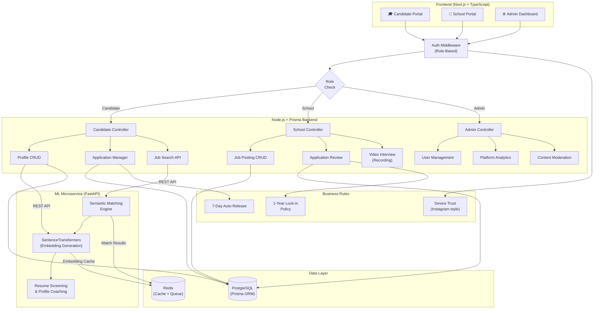

[<i class="fab fa-fw fa-github"></i> View Source Code](https://github.com/chhayanshporwal/teacher-recruitment-system)

**Summary:** A full-stack web platform with an integrated ML matching engine designed to centralize and intelligently streamline the hiring process for educational institutions.

*   **Problem:** The hiring process for schools is highly fragmented, lacking a unified platform that can simultaneously handle candidate applications, school job postings, and overarching system administration — let alone intelligently match candidates to opportunities.
*   **Solution:** Engineered a dedicated Python/FastAPI microservice utilizing SentenceTransformers to generate semantic embeddings for automated resume screening and profile coaching. Integrated the ML service with a Next.js and Node.js/Prisma backend architecture, utilizing REST APIs and Redis for efficient data handoffs. Developed secure backend controllers to serve three distinct user portals (Candidate, School, Admin) from a single unified database.
*   **Tech Stack:** Next.js, Node.js, Prisma, TypeScript, Python, FastAPI, SentenceTransformers, Redis.
*   **Outcome:** Delivered a scalable ML-powered architecture capable of intelligently pairing candidates with schools, supporting dynamic user roles, and handling robust authentication across the platform.

### System Architecture

*   **What I learned:** Greatly strengthened my full-stack capabilities — particularly in integrating ML microservices with production backends, structuring robust Node.js controllers with Prisma ORM, and managing state across TypeScript and Python services via Redis.