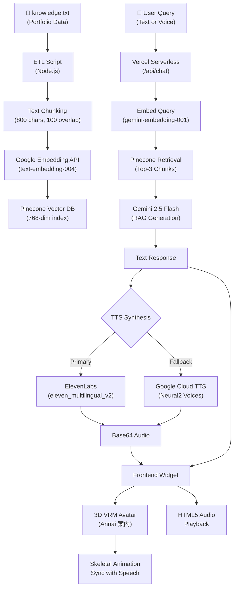

**Summary:** A production-grade Retrieval-Augmented Generation assistant deployed as an interactive 3D widget across the entire portfolio — answering questions about Chhayansh's work in natural voice.

*   **Problem:** Static portfolios fail to engage visitors or convey the depth of engineering work. Recruiters skim pages without understanding the technical nuance behind each project.
*   **Solution:** Engineered a full-stack RAG pipeline: a custom ETL script chunks and embeds portfolio knowledge into Pinecone using Google's embedding API. A Vercel serverless function retrieves relevant context, generates conversational responses via Gemini, and synthesizes speech through a multi-tier TTS fallback (ElevenLabs → Google Cloud TTS). The frontend renders a 3D VRM avatar (Annai) using Three.js with skeletal animation synced to audio playback.
*   **Tech Stack:** Gemini 2.5 Flash, Pinecone, Google Embeddings API, ElevenLabs TTS, Three.js, @pixiv/three-vrm, Vercel Serverless.
*   **Outcome:** Visitors can ask questions in English or Hindi and receive voiced, contextually accurate answers with source citations — directly from a 3D character sitting on the chat panel.

### RAG Pipeline Architecture

*   **What I learned:** Mastered end-to-end RAG system design — from ETL vectorization through serverless retrieval to real-time 3D avatar rendering and multi-provider TTS fallback engineering.
